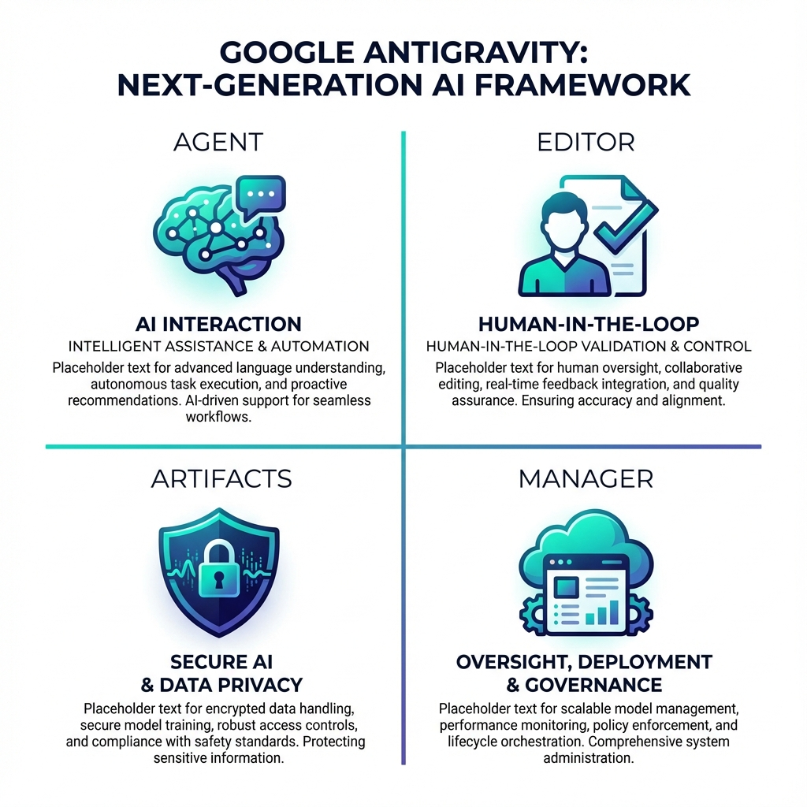

# 📝 2026-01-06 

---
[Tina Huang New Video](https://youtu.be/JHF2t-S2nm0?si=OGppG_KpbfR2HIz_)
 
<iframe width="100%" height="400" src="https://www.youtube.com/embed/JHF2t-S2nm0" title="YouTube video player" frameborder="0" allow="accelerometer; autoplay; clipboard-write; encrypted-media; gyroscope; picture-in-picture; web-share" allowfullscreen></iframe>

## 1교시 - 09:00 ~ 12:00
> **주제:** AI 도구(Antigravity) 심화 활용 및 Git/GitHub 협업 기초
---
### 📌 오늘의 강의 핵심 요약
이번 강의에서는 **Google Antigravity**의 에이전트(Agent), 아티팩트(Artifacts), 멀티모달 등 심화 기능을 마스터하고, AI 사용 시 필수적인 **'Human-in-the-loop(인간 개입)'**의 중요성을 다루었습니다. 후반부에는 협업의 필수 도구인 **Git & GitHub**의 개념을 이해하고 첫 저장소를 구축하는 실습을 진행했습니다.

---

### 📚 상세 내용 정리

#### 1️⃣ Google Antigravity: 스마트하고 안전한 AI 활용법

*   **시스템 구성**: VS Code를 기반으로 제작되어 익숙한 사용 환경을 제공합니다.
*   **4대 핵심 구성**:
    *   **Agent**: 사용자의 명령을 직접 수행하는 인공지능 주체
    *   **Editor**: 실시간 코드 작성 및 수정이 이루어지는 공간
    *   **Artifacts**: AI의 작업 계획(Plan)과 중간 결과물을 시각화하는 보고서
    *   **Agent Manager**: 여러 에이전트를 동시에 제어하는 클라우드 관제탑
*   **안전한 AI 제어 (Human-in-the-loop)**:
    *   **Request Review**: AI가 파일 삭제 등 민감한 작업을 하기 전 사용자의 승인을 받도록 설정
    *   **Prompting 전략**:
        *   `Soft`: AI의 자율성을 존중하는 권장 사항
        *   `Strict`: 절대 어겨서는 안 되는 강제 지침

#### 2️⃣ AI의 멀티모달 & 파일 시스템 제어
*   **멀티모달(Multimodal)**: 텍스트를 넘어 이미지 분석 및 생성까지 가능 (예: 사진 속 환경 분석 등)
*   **강력한 파일 제어**: AI는 코드 생성뿐만 아니라 파일 삭제(`Delete`) 권한도 가집니다.
*   ⚠️ **주의 사항**: `.env`와 같은 보안 파일이나 중요한 DB 파일이 AI에 의해 실수로 노출/삭제되지 않도록 철저한 검토가 필요합니다.

#### 3️⃣ Git & GitHub: 버전 관리와 협업의 시작
*   **Git의 정의**: 파일의 변경 이력을 추적하고 관리하는 분산 버전 관리 시스템
*   **핵심 가치**: '누가, 언제, 무엇을' 수정했는지 기록하여 과거 시점으로 복구하거나 협업 충돌을 방지함
*   **도구 선택**:
    *   **CLI (터미널)**: `git add`, `git commit` 등 명령어로 정밀 제어
    *   **GUI (그래픽)**: GitHub Desktop 등을 통해 마우스 클릭으로 직관적 관리
*   ✨ **Tip**: 최근 AI는 변경된 내용을 분석해 **Commit Message**를 자동으로 생성해 주기도 합니다.

#### 4️⃣ 실무 Git 명령어 흐름 (CLI Reference)
실제 터미널에서 협업 시 사용하는 표준 프로세스입니다.
1.  `git status`: 현재 변경된 파일 상태 확인
2.  `git add .`: 변경 사항을 기록 대기 상태(Staging Area)로 추가
3.  `git commit -m "메시지"`: 현재 상태를 하나의 버전으로 확정
4.  `git push`: 확정된 버전을 원격 저장소(GitHub)로 전송

---

### 💡 핵심 포인트 (Takeaway)
*   **AI의 통제권**: AI는 도구일 뿐, 최종 의사결정은 인간이 내리는 **'Review 습관'**이 가장 중요합니다.
*   **보안 제일**: AI 에이전트가 접근할 수 있는 범위와 보안 파일 보호에 대해 항상 인지해야 합니다.
*   **협업의 기술**: Git 사용 시 가급적 작업 영역을 나누어 **충돌(Conflict)**을 최소화하는 것이 초기 학습 단계에서 유리합니다.

---

### ✅ 오늘의 실습 과제
**GitHub 첫 저장소(Repository) 구축하기**
1.  GitHub 로그인 후 상단 `+` 버튼 → `New repository` 클릭
2.  이름 설정: **`KDT_Woongjin`** 입력
3.  초기화 옵션: **`Add a README file`** 체크 (필수)
4.  완료: **`Create repository`** 버튼 클릭

---

### 🔗 관련 핵심 키워드
| 키워드 | 설명 |
| :--- | :--- |
| **Google Antigravity** | AI 기반의 지능형 코드 에디터 |
| **Human-in-the-loop** | AI의 판단에 인간이 개입하여 안전성을 높이는 방식 |
| **Commit (커밋)** | 변경된 사항을 하나의 '버전'으로 저장소에 남기는 행위 |
| **Push / Pull** | 로컬 버전을 올리거나(Push), 원격 버전을 가져오는(Pull) 작업 |
| **Conflict (충돌)** | 동일한 파일의 같은 부분을 여러 명이 수정했을 때 발생하는 현상 |

## 2교시 - 10:00 ~ 11:00
