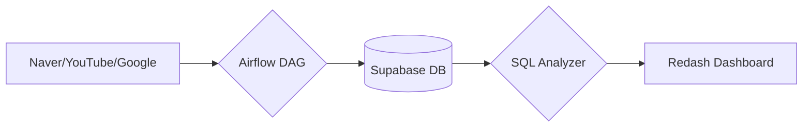
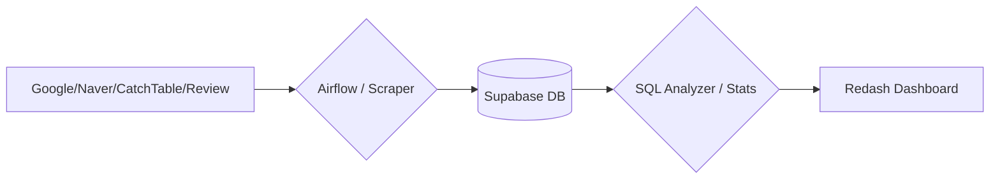

# 📝 2026-01-14 강의 노트

## 📢 프로젝트 안내
안녕하세요! 이번 주 배운 내용을 토대로 진행할 프로젝트 세부 계획입니다. 
이번 프로젝트의 핵심은 **'AI를 도구로 활용해 엔드투엔드(E2E) 파이프라인을 직접 구축하고 비즈니스 해답을 찾아내는 것'**입니다.

### 🗓️ 프로젝트 일정
| 일정 | 프로젝트명 | 목표 | 주요 작업 |
| :--- | :--- | :--- | :--- |
| **01/12 ~ 01/13** | 서울 지하철 데이터 통합 파이프라인 | 시스템 안정성 검증 및 인사이트 도출 | Airflow 스케줄링, 가설 검정 실습, Redash 시각화 |
| **01/14 ~ 01/16** | 자유 주제 캡스톤 프로젝트 | 관심 도메인 데이터 기반 포트폴리오 구축 | 문제 정의, 아키텍처 설계, AI-Native 구현 |

### 💡 강사 공지사항
- **리소스 지원**: 실습을 위한 Airflow 공용 서버가 구축되었습니다.
- **데이터 셋업**: 서울시 지하철 관련 모든 데이터(정적 시간표, 위치 정보, 실시간 위치 등)가 DB에 셋업되어 있습니다.
- **포커스**: 분석과 설계에 바로 집중하실 수 있도록 준비해 두었으니 활기찬 프로젝트 진행 부탁드립니다.

---

## 👥 팀 구성
- **1팀**: 장혜성, 윤소정
- **2팀**: 배승재, 박지원
- **3팀**: 신승우, 오재철
- **4팀**: 정서하, 문효준
- **5팀**: 이찬구, 김재민
- **6팀(3인)**: 윤화영, 신지해, 김승현

---

## 📋 자유 주제 캡스톤 프로젝트 계획서

### [참고] 프로젝트 템플릿 구조

템플릿 보기

1. **프로젝트 기본 정보**: 프로젝트명, 팀원, 진행 기간
2. **문제 정의 (Why)**: 해결하고자 하는 문제, 중요성, 타겟 사용자, 핵심 질문(3개)
3. **데이터 소스**: 출처, 수집 주기, 볼륨, 파일 형식
4. **아키텍처 설계**: 파이프라인 Mermaid 다이어그램, 상세 설계, 스케줄, 테이블 구조, 쿼리 로직
5. **구현 체크리스트**: Day 1~3 일정별 목표
6. **예상 결과물**: 대시보드 구성, 인사이트, 비즈니스 임팩트

---

### 🚀 2팀: 두쫀핑 (배승재, 박지원)

#### 1. 프로젝트 기본 정보
- **프로젝트명**: 두바이 쫀득 쿠키의 시장성과 수익성 분석을 위한 데이터 기반 비즈니스 인사이트 도출
- **팀원**: 배승재, 박지원
- **진행 기간**: 2026년 1월 14일(수) ~ 1월 16일(금)

#### 2. 문제 정의 (Why)
- **해결하고자 하는 문제**: 원자재값 폭등(피스타치오 약 122%↑) 상황에서 객관적 지표 없이 '감'에 의존한 메뉴 도입 및 가격 책정으로 발생하는 소상공인의 경영 리스크 해결.
- **왜 이 문제가 중요한가?**: '대만 카스테라', '탕후루' 등 F&B 시장의 '반짝 유행' 전례를 분석하여, 두바이 쫀득 쿠키의 지속 가능성을 진단하고 데이터 기반 의사결정 근거를 마련함.
- **타겟 사용자**: 메뉴 도입을 고민 중인 예비 창업자 및 수익 구조 재설계가 필요한 현재 운영자.
- **핵심 질문**:
  1. 원자재 쇼크에도 소비자의 실제 맛 만족도와 재방문 의사가 유지되는가?
  2. 유튜브 등 SNS 지표 변화를 통해 트렌드 하락세를 선제적으로 포착할 수 있는가?
  3. 과거 유행 사례(탕후루, 요아정)와 비교했을 때 현재의 라이프사이클 위치는 어디인가?

#### 3. 데이터 소스
- **데이터 출처**: 네이버 API(블로그, 데이터랩), 구글 트렌드, 유튜브 데이터 API, 국제 원자재 시세 보도자료.
- **수집 주기**: 프로젝트 기간 내 배치(Batch) 수집 및 시계열 분석.
- **데이터 볼륨**: 플랫폼별 검색량, 업로드량, 조회수, 댓글수, 좋아요수 등.
- **API/파일 형식**: JSON, PostgreSQL (Supabase).

#### 4. 아키텍처 설계

- **상세 설계**: `daily_trend_analysis_dag`를 통해 매일 새로 발생한 데이터만 중복 없이 수집(증분 추출).
- **데이터 적재 테이블**: `trend_metrics` (date, platform, keyword, search_volume, upload_count, etc.)
- **분석 쿼리 로직**: 통합 관심도 지수 산출, 인기 감쇠율 계산, 과거 사례 패턴 매칭 및 현재 단계(진입/절정/쇠퇴) 판별.

#### 5. 구현 체크리스트
- [x] **Day 1**: 문제 정의 및 소스 확정, Scraper 스크립트 모듈화 및 테스트 수집
- [ ] **Day 2**: Supabase 테이블 설계 및 생성, Airflow 연동 자동화 완성, 통합 분석 전처리
- [ ] **Day 3**: Redash 대시보드 구축(비교 차트/히트맵), 비즈니스 인사이트 도출 및 발표 준비

#### 6. 예상 결과물
- **대시보드**: 통합 트렌드 레이더, 시장 포화도 지표(검색량 vs 콘텐츠 공급량), 관심도 비교 레이더.
- **인사이트**: 수요-공급 불균형 분석을 통한 수익 가능 기간 예측, 과거 사례 비교 기반 유행 종료 시점 예측.
- **비즈니스 임팩트**: 소상공인의 무분별한 유행 아이템 창업 방지 및 데이터 근거 기반 투자/가격 정책 가이드 제공.

---

### 🚀 4팀: 정서하, 문효준

#### 1. 프로젝트 기본 정보
- **프로젝트명**: <흑백요리사 2> 분석: 디지털 화제성, 요리 장르 생존율 및 상권 변화의 상관관계 연구
- **팀원**: 정서하, 문효준
- **진행 기간**: 2026년 1월 14일(수) ~ 1월 16일(금)

#### 2. 문제 정의 (Why)
- **해결하고자 하는 문제**: 미디어를 통해 발생한 디지털 화제성이 실제 오프라인 소비 행동과 지역 상권 변화로 어떻게 전환되는지 정량적 검증.
- **왜 이 문제가 중요한가?**: 온라인 평판과 트렌드가 잠재 매출의 선행 지표임을 규명하고, 미디어 노출이 식당 방문 수요 및 인근 상권에 미치는 낙수효과(Spillover Effect)를 분석하기 위함.
- **타겟 사용자**: 외식업 마케터, 상권 분석가, 방송 콘텐츠 기획자.
- **핵심 질문**:
  1. 출연자 닉네임/레시피 검색량 증가가 식당명 검색 및 방문으로 이어지는 시차는 어떠한가?
  2. 요리 장르(한식/일식 등)에 따라 서바이벌 내 라운드별 생존율에 유의미한 통계적 차이가 있는가?
  3. 출연자 식당 중심 50m 격자 내 유동인구 변화가 방송 전후 어떻게 달라지는가?

#### 3. 데이터 소스
- **데이터 출처**: 구글 트렌드, 네이버 데이터랩, 캐치테이블(식당 검색/예약), 네이버 리뷰, 공공 유동인구 데이터, 나무위키.
- **수집 주기**: 검색 트렌드 및 유동인구(3시간 단위), 라운드별 데이터(배치).
- **데이터 볼륨**: 약 42,000행 이상 (시간 × 식당 × 키워드 × 위치).
- **API/파일 형식**: CSV, JSON.

#### 4. 아키텍처 설계

- **상세 설계**: 키워드 정규화, 요리 장르 분류, 식당 위치 기준 50m 격자 매핑.
- **분석 쿼리 로직**: 검색→방문 전환 시차 분석, 장르별 생존율 통계 검정(카이제곱), 차이-차분(DID) 기반 상권 분석.

#### 5. 구현 체크리스트
- [x] **Day 1**: 문제 정의 및 데이터 소스 확정, 크롤러/API 연동 모듈 초안 작성
- [ ] **Day 2**: DB 스키마 설계, 데이터 클렌징 및 적재 자동화, 장르별 생존율 통계 로직 구현
- [ ] **Day 3**: Redash 대시보드 구축(시계열/히트맵), 인사이트 도출 및 최종 리포트 완성

#### 6. 예상 결과물
- **대시보드**: 검색 트렌드 타임라인, 장르별 생존율 비교 분석, 상권 유동인구 변화 히트맵.
- **인사이트**: 미디어 노출의 공간적 수요 유발 효과 측정, 콘텐츠 화제성의 실질적 경제 가치 평가.
- **비즈니스 임팩트**: 방송 출연 이후 브랜드 관리 전략 수립 지원 및 지역 상권 활성화 지표 제공.

---
[참고 문헌 및 출처]
- 두바이 쿠키 相关 뉴스: [Eyesmag](https://www.eyesmag.com/posts/163456/dubai-chewy-cookie), [YTN](https://www.ytn.co.kr/_ln/0134_202601120825005601), [연합뉴스](https://www.yna.co.kr/view/AKR20260111000900030)
- <흑백요리사> 분석 관련 배경: Yelp 별점 및 매출 상관관계 연구, 미디어 유발 수요(Media-induced demand) 현황