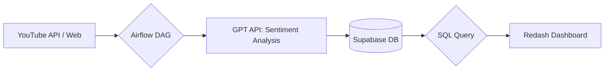
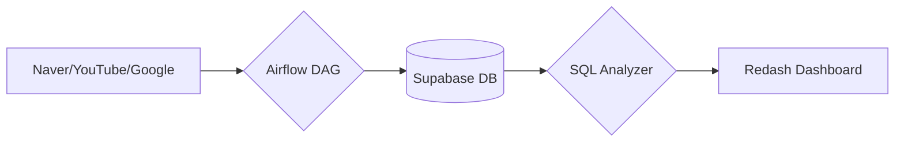
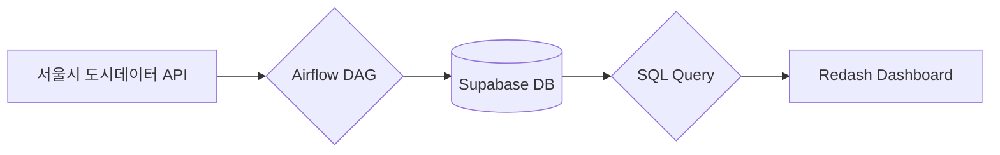
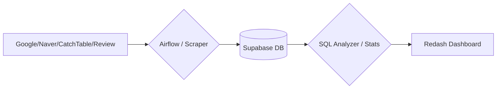
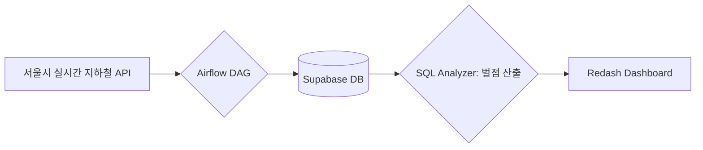

# 📝 2026-01-14 강의 노트

## 📢 프로젝트 안내
안녕하세요! 이번 주 배운 내용을 토대로 진행할 프로젝트 세부 계획입니다. 
이번 프로젝트의 핵심은 **'AI를 도구로 활용해 엔드투엔드(E2E) 파이프라인을 직접 구축하고 비즈니스 해답을 찾아내는 것'**입니다.

### 🗓️ 프로젝트 일정
| 일정 | 프로젝트명 | 목표 | 주요 작업 |
| :--- | :--- | :--- | :--- |
| **01/12 ~ 01/13** | 서울 지하철 데이터 통합 파이프라인 | 시스템 안정성 검증 및 인사이트 도출 | Airflow 스케줄링, 가설 검정 실습, Redash 시각화 |
| **01/14 ~ 01/16** | 자유 주제 캡스톤 프로젝트 | 관심 도메인 데이터 기반 포트폴리오 구축 | 문제 정의, 아키텍처 설계, AI-Native 구현 |

### 💡 강사 공지사항
- **리소스 지원**: 실습을 위한 Airflow 공용 서버가 구축되었습니다.
- **데이터 셋업**: 서울시 지하철 관련 모든 데이터(정적 시간표, 위치 정보, 실시간 위치 등)가 DB에 셋업되어 있습니다.
- **포커스**: 분석과 설계에 바로 집중하실 수 있도록 준비해 두었으니 활기찬 프로젝트 진행 부탁드립니다.

---

## 👥 팀 구성
- **1팀**: 장혜성, 윤소정
- **2팀**: 배승재, 박지원
- **3팀**: 신승우, 오재철
- **4팀**: 정서하, 문효준
- **5팀**: 이찬구, 김재민
- **6팀(3인)**: 윤화영, 신지해, 김승현

---

## 📋 자유 주제 캡스톤 프로젝트 계획서

### [참고] 프로젝트 템플릿 구조

템플릿 보기

1. **프로젝트 기본 정보**: 프로젝트명, 팀원, 진행 기간
2. **문제 정의 (Why)**: 해결하고자 하는 문제, 중요성, 타겟 사용자, 핵심 질문(3개)
3. **데이터 소스**: 출처, 수집 주기, 볼륨, 파일 형식
4. **아키텍처 설계**: 파이프라인 Mermaid 다이어그램, 상세 설계, 스케줄, 테이블 구조, 쿼리 로직
5. **구현 체크리스트**: Day 1~3 일정별 목표
6. **예상 결과물**: 대시보드 구성, 인사이트, 비즈니스 임팩트

---
### 🚀 1팀: 장혜성, 윤소정

#### 1. 프로젝트 기본 정보
- **프로젝트명**: 환승연애2 서사 데이터 분석을 통한 시청자 과몰입 요인 및 매력 자본 수치화
- **팀원**: 장혜성, 윤소정
- **진행 기간**: 2026년 1월 14일(수) ~ 1월 16일(금)

#### 2. 문제 정의 (Why)
- **해결하고자 하는 문제**: 연애 리얼리티의 흥행을 결정짓는 '서사(Narrative)'의 힘을 정량적으로 분석하고, 성격 유형(MBTI)에 따른 감정 회복 탄력성 차이를 규명함.
- **왜 이 문제가 중요한가?**: 콘텐츠 제작 및 마케팅 관점에서 시청자가 열광하는 '성공 방정식'을 도출하여 향후 캐스팅 및 편집 전략의 객관적 근거로 활용 가능함.
- **타겟 사용자**: 예능 프로그램 제작 PD/작가, 콘텐츠 마케팅 전략 수립자.
- **핵심 질문**:
  1. 부정적 감정이 긍정으로 반전되는 'V자 서사'에서 화제성이 가장 폭발하는가?
  2. 성격 유형(T/F)에 따라 갈등 상황 시 감정 단어 빈도와 회복 속도에 차이가 있는가?
  3. 출연자 간 '케미 지수'가 실제 매칭 결과 및 화제성을 예측하는 지표가 될 수 있는가?
- **주요 지수 정의**:
  - **과몰입 지수**: 유튜브 조회수 대비 댓글/좋아요 비율.
  - **감정 점수**: 발화/행동 기반 감정 수치 (-1.0 ~ 1.0).
  - **매력 자본**: 주요 사건 전후 SNS 팔로워 및 커뮤니티 언급량 증가분.

#### 3. 데이터 소스
- **데이터 출처**: 나무위키(에피소드 요약), YouTube Data API(티빙 채널), SNS(인스타그램 팔로워 변동).
- **수집 주기**: 프로젝트 기간 내 시즌 2 전체 회차 대상 단건 수집.
- **데이터 볼륨**: 20개 회차 및 10명의 출연자 로그, 유튜브 댓글 수만 건.
- **API/파일 형식**: JSON, CSV, Text.

#### 4. 아키텍처 설계

- **상세 설계**: Airflow로 데이터를 수집하고 GPT API를 활용해 텍스트에서 `sentiment_score`를 추출하여 적재함.
- **데이터셋 구성**: 출연자 프로필, 회차별 사건 로그, 유튜브 콘텐츠 반응 지표, 댓글 키워드 빈도.

#### 5. 구현 체크리스트
- [x] **Day 1**: 유튜브 API 연결 및 영상 리스트 수집, 분석 대상 핵심 인물 선정
- [ ] **Day 2**: Supabase 스키마 생성, GPT API 연동 감성 분석 자동화, MBTI 메타데이터 매핑
- [ ] **Day 3**: Redash 대시보드 구축(감정 타임라인 & 화제성 차트), 인사이트 도출 및 발표 준비

#### 6. 예상 결과물
- **대시보드**: 출연자별 서사 굴곡 차트, 과몰입 히트맵(멤버 조합별 반응), MBTI 레이더 차트.
- **인사이트**: "결핍의 해소"가 시청자 과몰입에 미치는 영향 분석, 갈등 해결 속도와 화제성 유지의 상관관계.
- **비즈니스 임팩트**: 화제성 극대화를 위한 페르소나 믹스 가이드라인 및 하이라이트 편집 우선순위 제안.

---

### 🚀 2팀: 두쫀핑 (배승재, 박지원)

#### 1. 프로젝트 기본 정보
- **프로젝트명**: 두바이 쫀득 쿠키의 시장성과 수익성 분석을 위한 데이터 기반 비즈니스 인사이트 도출
- **팀원**: 배승재, 박지원
- **진행 기간**: 2026년 1월 14일(수) ~ 1월 16일(금)

#### 2. 문제 정의 (Why)
- **해결하고자 하는 문제**: 원자재값 폭등(피스타치오 약 122%↑) 상황에서 객관적 지표 없이 '감'에 의존한 메뉴 도입 및 가격 책정으로 발생하는 소상공인의 경영 리스크 해결.
- **왜 이 문제가 중요한가?**: '대만 카스테라', '탕후루' 등 F&B 시장의 '반짝 유행' 전례를 분석하여, 두바이 쫀득 쿠키의 지속 가능성을 진단하고 데이터 기반 의사결정 근거를 마련함.
- **타겟 사용자**: 메뉴 도입을 고민 중인 예비 창업자 및 수익 구조 재설계가 필요한 현재 운영자.
- **핵심 질문**:
  1. 원자재 쇼크에도 소비자의 실제 맛 만족도와 재방문 의사가 유지되는가?
  2. 유튜브 등 SNS 지표 변화를 통해 트렌드 하락세를 선제적으로 포착할 수 있는가?
  3. 과거 유행 사례(탕후루, 요아정)와 비교했을 때 현재의 라이프사이클 위치는 어디인가?

#### 3. 데이터 소스
- **데이터 출처**: 네이버 API(블로그, 데이터랩), 구글 트렌드, 유튜브 데이터 API, 국제 원자재 시세 보도자료.
- **수집 주기**: 프로젝트 기간 내 배치(Batch) 수집 및 시계열 분석.
- **데이터 볼륨**: 플랫폼별 검색량, 업로드량, 조회수, 댓글수, 좋아요수 등.
- **API/파일 형식**: JSON, PostgreSQL (Supabase).

#### 4. 아키텍처 설계

- **상세 설계**: `daily_trend_analysis_dag`를 통해 매일 새로 발생한 데이터만 중복 없이 수집(증분 추출).
- **데이터 적재 테이블**: `trend_metrics` (date, platform, keyword, search_volume, upload_count, etc.)
- **분석 쿼리 로직**: 통합 관심도 지수 산출, 인기 감쇠율 계산, 과거 사례 패턴 매칭 및 현재 단계(진입/절정/쇠퇴) 판별.

#### 5. 구현 체크리스트
- [x] **Day 1**: 문제 정의 및 소스 확정, Scraper 스크립트 모듈화 및 테스트 수집
- [ ] **Day 2**: Supabase 테이블 설계 및 생성, Airflow 연동 자동화 완성, 통합 분석 전처리
- [ ] **Day 3**: Redash 대시보드 구축(비교 차트/히트맵), 비즈니스 인사이트 도출 및 발표 준비

#### 6. 예상 결과물
- **대시보드**: 통합 트렌드 레이더, 시장 포화도 지표(검색량 vs 콘텐츠 공급량), 관심도 비교 레이더.
- **인사이트**: 수요-공급 불균형 분석을 통한 수익 가능 기간 예측, 과거 사례 비교 기반 유행 종료 시점 예측.
- **비즈니스 임팩트**: 소상공인의 무분별한 유행 아이템 창업 방지 및 데이터 근거 기반 투자/가격 정책 가이드 제공.

---

### 🚀 3팀: 오재철, 신승우

#### 1. 프로젝트 기본 정보
- **프로젝트명**: 시간대별 유동·소비 데이터 기반 서울 지역 클러스터링
- **팀원**: 오재철, 신승우
- **진행 기간**: 2026년 1월 14일(수) ~ 1월 16일(금)

#### 2. 문제 정의 (Why)
- **해결하고자 하는 문제**: 동일 공간이라도 시간대에 따라 유동인구와 소비 행태가 달라지지만, 기존 분석은 일 평균 기준에 머물러 실질적 변화를 반영하지 못하는 문제 해결.
- **왜 이 문제가 중요한가?**: 시간대 특성을 배제한 상권 분석은 비효율적인 마케팅과 입지 선정으로 이어지므로, 실제 소비가 발생하는 '골든아워'를 포착해야 함.
- **타겟 사용자**: 서울시 창업 희망자, 상권 기획 및 마케팅 담당자.
- **핵심 질문**:
  1. 서울시 주요 장소 중 유동인구 밀도가 가장 높은 군집은 어디인가?
  2. 특정 지역 방문객의 주된 성별·연령대 특성은 무엇인가?
  3. 인구수 대비 카드 결제액이 가장 높은 시간대와 최적 업종은 무엇인가?

#### 3. 데이터 소스
- **데이터 출처**: 서울시 실시간 도시데이터 API (인구·상권).
- **수집 주기**: 프로젝트 기간 중 1일간, 10분 간격 수집.
- **데이터 볼륨**: 약 17,280건 (서울시 주요 120개 장소 기준).
- **API/파일 형식**: Open API (JSON/XML).

#### 4. 아키텍처 설계

- **상세 설계**: 10분 주기로 데이터를 수집하여 실시간 혼잡도, 인구 분포, 업종별 카드 결제 정보를 적재함.
- **데이터 적재 테이블**: `area_metrics` (기준 축: 장소 + 시간).

#### 5. 구현 체크리스트
- [x] **Day 1**: API 확정 및 Airflow 연동 자동화, Supabase 테이블 설계
- [ ] **Day 2**: 데이터 전처리 및 분석 로직 구현, 대시보드 시각화 초안 완료
- [ ] **Day 3**: 군집화 분석 결과 도출, 최종 발표용 리포트 및 발표 자료 작성

#### 6. 예상 결과물
- **대시보드**: 지역별 상권 분석 시각화(유동인구, 카드 결제 건수, 매출 규모).
- **인사이트**: 주말 여가 중심 지역과 실질 소비 중심 지역의 분리 및 시간대별 상권 특성 정의.
- **비즈니스 임팩트**: 시간대 기반 상권 전략 최적화 및 업종별 효율적 입지 선정 가이드라인 제공.

---

### 🚀 4팀: 정서하, 문효준

#### 1. 프로젝트 기본 정보
- **프로젝트명**: <흑백요리사 2> 분석: 디지털 화제성, 요리 장르 생존율 및 상권 변화의 상관관계 연구
- **팀원**: 정서하, 문효준
- **진행 기간**: 2026년 1월 14일(수) ~ 1월 16일(금)

#### 2. 문제 정의 (Why)
- **해결하고자 하는 문제**: 미디어를 통해 발생한 디지털 화제성이 실제 오프라인 소비 행동과 지역 상권 변화로 어떻게 전환되는지 정량적 검증.
- **왜 이 문제가 중요한가?**: 온라인 평판과 트렌드가 잠재 매출의 선행 지표임을 규명하고, 미디어 노출이 식당 방문 수요 및 인근 상권에 미치는 낙수효과(Spillover Effect)를 분석하기 위함.
- **타겟 사용자**: 외식업 마케터, 상권 분석가, 방송 콘텐츠 기획자.
- **핵심 질문**:
  1. 출연자 닉네임/레시피 검색량 증가가 식당명 검색 및 방문으로 이어지는 시차는 어떠한가?
  2. 요리 장르(한식/일식 등)에 따라 서바이벌 내 라운드별 생존율에 유의미한 통계적 차이가 있는가?
  3. 출연자 식당 중심 50m 격자 내 유동인구 변화가 방송 전후 어떻게 달라지는가?

#### 3. 데이터 소스
- **데이터 출처**: 구글 트렌드, 네이버 데이터랩, 캐치테이블(식당 검색/예약), 네이버 리뷰, 공공 유동인구 데이터, 나무위키.
- **수집 주기**: 검색 트렌드 및 유동인구(3시간 단위), 라운드별 데이터(배치).
- **데이터 볼륨**: 약 42,000행 이상 (시간 × 식당 × 키워드 × 위치).
- **API/파일 형식**: CSV, JSON.

#### 4. 아키텍처 설계

- **상세 설계**: 키워드 정규화, 요리 장르 분류, 식당 위치 기준 50m 격자 매핑.
- **분석 쿼리 로직**: 검색→방문 전환 시차 분석, 장르별 생존율 통계 검정(카이제곱), 차이-차분(DID) 기반 상권 분석.

#### 5. 구현 체크리스트
- [x] **Day 1**: 문제 정의 및 데이터 소스 확정, 크롤러/API 연동 모듈 초안 작성
- [ ] **Day 2**: DB 스키마 설계, 데이터 클렌징 및 적재 자동화, 장르별 생존율 통계 로직 구현
- [ ] **Day 3**: Redash 대시보드 구축(시계열/히트맵), 인사이트 도출 및 최종 리포트 완성

#### 6. 예상 결과물
- **대시보드**: 검색 트렌드 타임라인, 장르별 생존율 비교 분석, 상권 유동인구 변화 히트맵.
- **인사이트**: 미디어 노출의 공간적 수요 유발 효과 측정, 콘텐츠 화제성의 실질적 경제 가치 평가.
- **비즈니스 임팩트**: 방송 출연 이후 브랜드 관리 전략 수립 지원 및 지역 상권 활성화 지표 제공.

---

### 🚀 5팀: 김재민, 이찬구

#### 1. 프로젝트 기본 정보
- **프로젝트명**: "너 왜 안 와?" - 서울 지하철 실시간 '초과 대기 시간' 랭킹 대시보드
- **팀원**: 김재민, 이찬구
- **진행 기간**: 2026년 1월 14일(수) ~ 1월 16일(금)

#### 2. 문제 정의 (Why)
- **해결하고자 하는 문제**: 단순 열차 위치가 아닌, "계획 대비 얼마나 늦어지고 있는가(지연 강도)"를 직관적으로 알려주지 못하는 기존 앱의 한계 해결.
- **왜 이 문제가 중요한가?**: 출근 시간이 정해진 직장인들에게 정시성은 가장 중요한 신뢰 지표이며, 대기 시간이 길어질수록 발생하는 '매몰 시간'을 가시화할 필요가 있음.
- **타겟 사용자**: 출퇴근길 연착 리스크를 관리하고 싶은 직장인.
- **핵심 질문**:
  1. 출근 시간대(07~10시)에 가장 믿을 수 있는 '칼도착' 호선은 어디인가?
  2. 실시간 데이터를 바탕으로 산출한 오늘의 '최적 출근 동선'은 어디인가?
  3. 오늘 하루 승객들이 지연으로 인해 낭비한 '총 초과 대기 시간'은 몇 분인가?

#### 3. 데이터 소스
- **데이터 출처**: 서울 열린데이터 광장 (실시간 지하철 열차 위치 정보).
- **수집 주기**: 1분 (열차 위치 변화 및 도착 시점 정밀 포착).
- **데이터 볼륨**: 일일 약 200MB~300MB 내외 (JSON).
- **API/파일 형식**: REST API (JSON).

#### 4. 아키텍처 설계

- **상세 설계**: 매분 수집된 데이터를 직전 분과 비교하여 지연 발생 시 벌점(Penalty Score)을 부여함. 
- **벌점 로직**: `도착 예상 시간 - 실제 도착 시각`을 기준으로 지연된 분(Minute)만큼 벌점을 집계.

#### 5. 구현 체크리스트
- [x] **Day 1**: 전체 호선 데이터 수집 성공, Airflow 1분 단위 수집 DAG 작성
- [ ] **Day 2**: 지연 시간 계산 핵심 로직 구현(Pandas), 벌점 집계 후 DB 적재 자동화
- [ ] **Day 3**: Redash 대시보드 구축(지연 호선 TOP 3 경고), 3일간의 지연 데이터 인사이트 도출

#### 6. 예상 결과물
- **대시보드**: 실시간 지연 점수판 (가장 늦는 호선 TOP 3), 시간대별 지연 벌점 추이 그래프.
- **인사이트**: 호선별 회전율 대비 지연 회복력 분석 (1호선 vs 2호선 사례).
- **비즈니스 임팩트**: 지하철 운영사의 취약 시간대 관제 지표로 활용 및 사용자에게 심리적 안정감을 주는 대체 경로 근거 제공.

---

## 📢 프로젝트 발표 안내

여러분들 오늘 프로젝트 마지막 날입니다!

오전까지는 발표자료 정리를 해보시고 
점심 드시고 오후 2시부터 발표를 진행해보려고 합니다.
팀당 발표 시간 10-15분 정도 분량으로 준비해주시면 됩니다.

6팀 순서는 이따 발표 직전에 마블룰렛으로 한번 정해볼게요.
https://lazygyu.github.io/roulette/

발표는 이런 순으로 준비해주시면 좋습니다.

### 📝 발표 자료 구성 가이드

발표에는 **데이터 분석 역량**과 **엔지니어링 기술력**이 조화롭게 드러나야 합니다. 단순히 결과를 나열하기보다, "어떤 문제를 어떻게 해결했는지"에 대한 **과정(Process)**을 중점적으로 보여주세요.

#### 1. 프로젝트 개요 (Introduction)
- **문제 정의 (Why)**: 왜 이 주제를 선정했나요? (개인적 호기심, 비즈니스적 가치 등)
- **목표**: 해결하고자 하는 핵심 질문 3가지는 무엇이었나요?
- **타겟**: 이 분석 결과나 서비스는 누구에게 필요한가요?

#### 2. 데이터 소개 및 정의 (Data Description) - ★ 필수 포함
분석에 사용한 데이터의 신뢰성을 증명하는 중요한 파트입니다. 듣는 사람이 데이터의 정체를 명확히 알 수 있도록 **상세하고 구체적으로** 적어주세요.
- **데이터 출처**: 데이터를 가져온 구체적인 URL (하이퍼링크 포함).
- **수집 기간 및 범위**: 언제부터 언제까지의 데이터인지? 전체 데이터인지 샘플링인지? 대상(Target)은 누구인지?
- **데이터 정의 및 해석**:
    - 테이블/컬럼의 의미가 무엇인지 설명해주세요.
    - 특이사항(결측치, 제외된 조건 등)이 있다면 반드시 언급해야 합니다.

> **작성 예시 (슬라이드나 설명에 포함될 내용)**
> - **적재 테이블**: `toss.school_info` (학교 기본 정보), `toss.meal_service_diet_info` (급식 식단)
> - **기간 및 범위**: 2021년 ~ 현재 / 전국 12,645개 초·중·고등학교
> - **출처**: [나이스 교육정보 개방포털 바로가기](URL)
> - **특이사항**: 방학 기간 데이터 제외, 매일 1회 갱신됨.

#### 3. 아키텍처 및 엔지니어링 (Engineering)
- **시스템 구성도**: Mermaid 다이어그램 등을 활용해 데이터 파이프라인 전체 흐름을 시각화해주세요.
    - 수집(Collection) -> 저장(Storage) -> 처리(Processing) -> 분석/시각화(Analysis/Viz)
- **기술 스택**: Airflow, Supabase, Redash, Python 라이브러리 등 사용한 도구를 명시하고 **"왜 이 도구를 썼는지"** 설명해주세요.
- **데이터 흐름**: 데이터가 어디서 어떻게 들어와서, 어떤 변환 과정을 거쳐 저장되는지 설명해주세요.

#### 4. 데이터 분석 및 핵심 기능 (Analysis & Features)
- **EDA (탐색적 데이터 분석)**: 수집된 데이터의 특징은 어떠한가요? (데이터 볼륨, 형태, 주요 통계량)
- **핵심 발견 (Insights)**: 데이터를 통해 발견한 재미있는 사실이나 패턴은 무엇인가요? 차트나 그래프로 시각화해서 보여주세요.
- **비즈니스 임팩트**: 이 분석 결과가 실제 비즈니스나 의사결정에 어떻게 도움이 될 수 있나요?

#### 5. ★ 트러블 슈팅 (Problem Solving) - 가장 중요한 파트!
프로젝트 진행 중 마주친 기술적/논리적 난관과 이를 극복한 과정을 **STAR 기법(Situation, Task, Action, Result)** 혹은 회고 형식으로 자세히 기술해주세요.
- **문제 상황 (Challenge)**: 크롤링 막힘, API 호출 제한, DB 연결 오류, 데이터 정합성 문제 등 구체적인 어려움.
- **시도한 방법 (Try)**: 문제를 해결하기 위해 어떤 시도들을 했나요? (실패한 시도 포함)
- **해결책 (Solution)**: 최종적으로 어떻게 해결했나요? (코드 수정, 로직 변경, 대안 모색 등)
- **배운 점 (Learned)**: 이 과정을 통해 무엇을 깨달았나요?

#### 6. 회고 및 결론 (Retrospective)
- **잘한 점**: 계획대로 잘 동작한 부분이나 팀워크가 좋았던 점.
- **아쉬운 점 & 개선 계획**: 시간이 더 있었다면 추가하고 싶은 기능이나 보완하고 싶은 점.
- **소감**: 3일간의 프로젝트를 마친 짧은 소회.

---
**💡 팁**: 발표 슬라이드에 **코드 스니펫(핵심 로직)**이나 **에러 로그**, **검색했던 레퍼런스** 등을 포함하면 엔지니어링 역량을 더 잘 보여줄 수 있습니다. 완벽한 결과물보다 치열했던 **고민의 흔적**이 더 높은 평가를 받습니다. 화이팅!